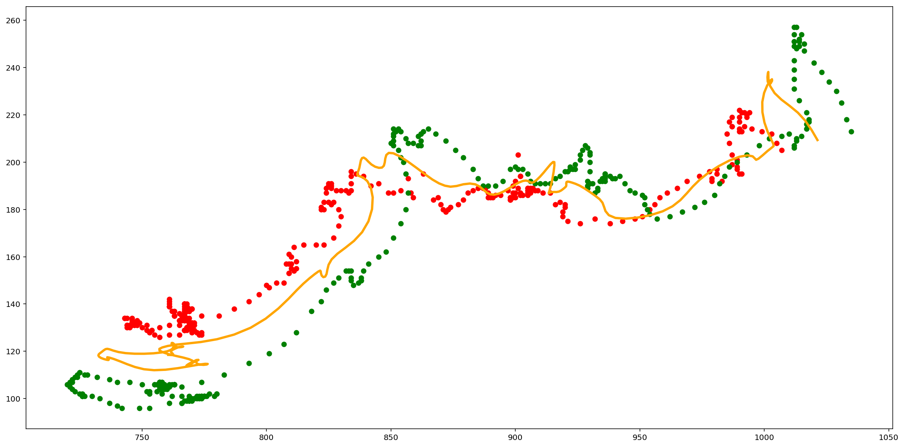
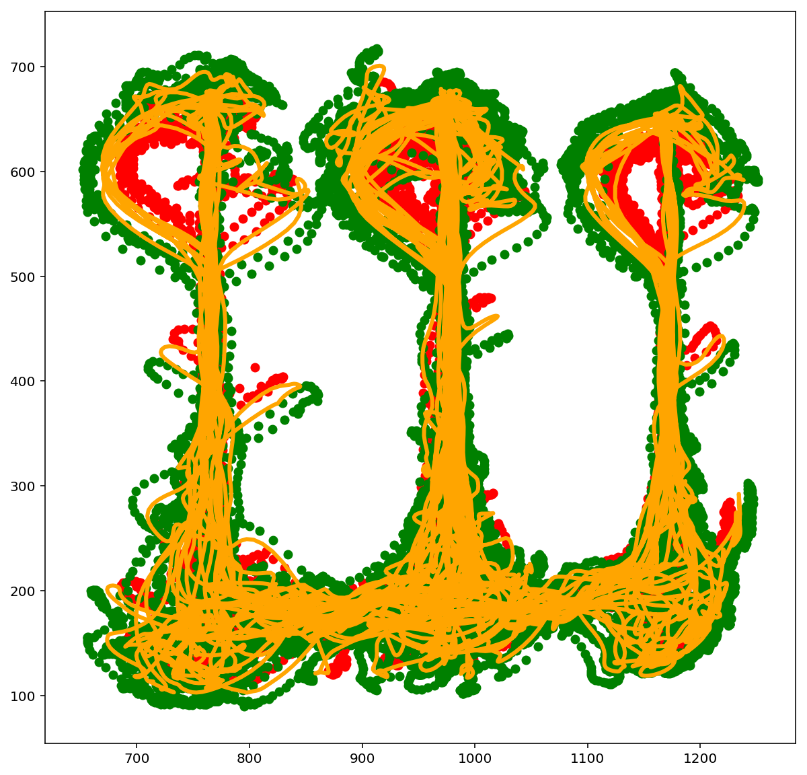

# video_behavior_tracking

This python package provides scripts and functions for extracting behavioral data (`position`, `velocity`, `acceleration`, `head direction`) from video for Loren Frank's datasets.

Animal behavior is tracked via an overhead video camera and red and green LEDs mounted on the head of the animal. Standard image processing techniques (color thresholding, gaussian blurring, dilation and erosion) are used to extract the position of the LEDS in the video.


Because the LEDs can be occluded due to recording equipment wires or the animal tilting its head down, Kalman filtering and smoothing is used to impute data missing from occlusions, extract variables not directly observed (`velocity`, `acceleration`) and take advantage of multiple sensors.

|   |  |
|:---:|:---:|
| Kalman smoothing| Whole dataset |


#### Installation
```
pip install video_behavior_tracking
```

OR

```
conda install -c edeno video_behavior_tracking
```

#### Usage

The easiest way to use this package is in the command line via the `track_behavior` function. It will output a `<animal>pos<day>.mat` file in the [Loren Frank data format](https://github.com/Eden-Kramer-Lab/Loren-Frank-Data-Format--Description/wiki/Position-Information).

```bash
track_behavior VIDEO_FILENAME_PATH CONFIG_FILE_PATH
```

Two elements are needed to run the function:

+ VIDEO_FILENAME_PATH -- path to the video file. The video file is expected to be in the following format:
  `<date>_<animal>_<epoch>.<optional_flag_depending_on_preprocessing>.<file_format>`

  where `file_format` can be `.h264`, `.avi`, `.mp4`

+ CONFIG_FILE_PATH -- a path to a simple `.json` configuration file.

```json
{
    "cm_to_pixels": 0.06545,
    "date_to_day": {
        "20161114": 1,
        "20161115": 2,
        "20161116": 3,
        "20161117": 4,
        "20161118": 5,
        "20161119": 6,
        "20161121": 7
    }
}
```

This file has two variables.
+ `cm_to_pixels` -- the ratio of centimeters to pixels.
+ `date_to_day` -- in order to convert date of the video recording to day of recording.


#### Optional flags

+ `--save_path SAVE_PATH` can be added to save the
+ `--save_video` can be added to create a video file with the estimated head position and direction imposed on the original video.


#### Development Note
In order to release to conda, after `conda skeleton` command, need change package in `meta.yml` from `opencv-python` to `opencv`.
